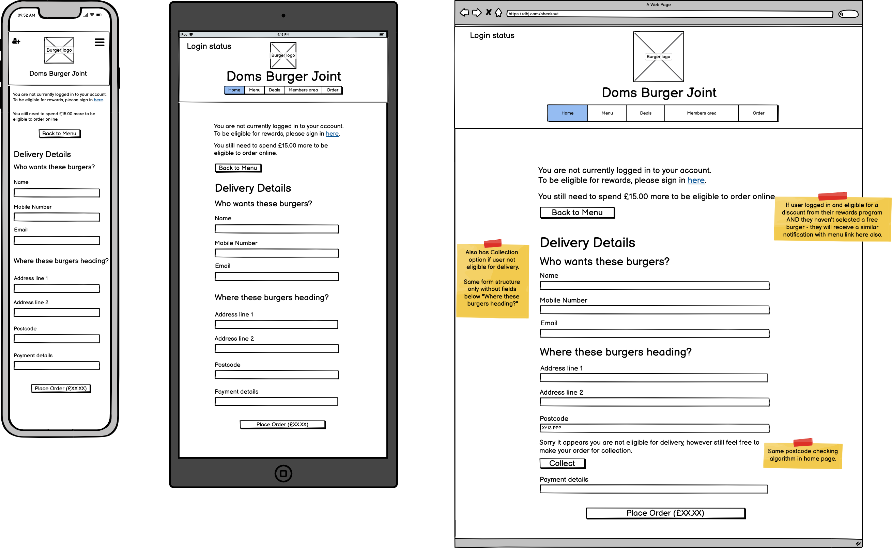
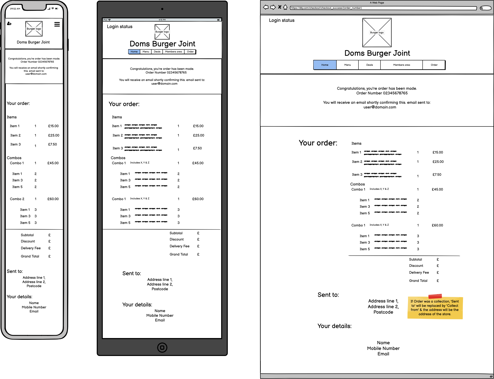
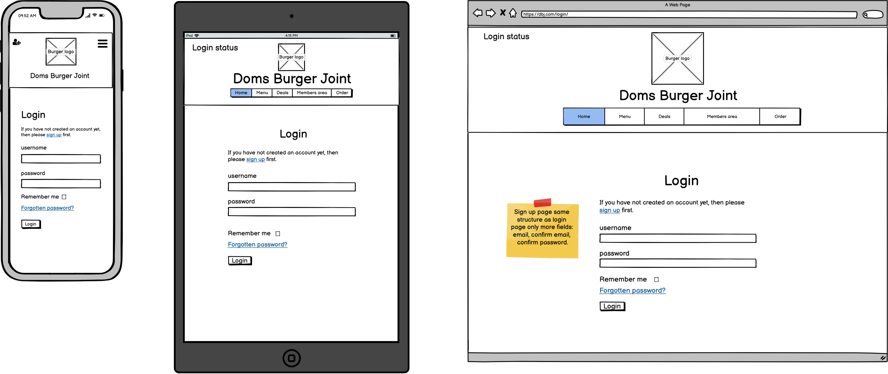

# Dom's Burger Joint 

A prototype for a burger delivery service's web application. Serving customers within the local region of central London.

# Contents

1. UX Design
    - [Site Goals](#site-goals)
    - [User Goals](#user-goals)
    - [User Stories](#user-stories)
    - [Color scheme](#color-scheme)
    - [Wireframes](#wireframes)

2. Features
    - [Core Features](#core-features)
    - [Non Essential Features](#non-essential-features)
    - [Features Left to Implement](#features-left-to-implement)

3. Technologies Used
    
4. Testing
    - [Manual Testing](#manual-testing)
    - [Automated Testing](#automated-testing)

5. Deployment

6. Credits
    - [Content](#content)
    - [Media](#media)
    - [Code](#code)
    - [Acknowledgements](#acknowledgements)

# UX Design
## Site Goals

- Attract customers through all areas of the site.
- Create excitement that eventually leads to an online sale.
- Make it easy for customers to purchase food online.
- Upsell other food items that the customer may have not initially considered to purchase.
- Encourage users who haven't visited the site before to sign up to the members area.
- Create service that rewards member loyalty.
- Handle user's information securely.

## User Goals
- Wants the site to look professional as this will most likely reflect the food quality.
- Easily navigate the site and find whatever they need within 3 clicks.
- Have plenty of information about what they are going to order to help them decide.
- Have some way of adjusting their order, if they need to change the quantity or remove an item.
- Be able to save money if ordering as a group.
- Have vegetarian options.
- Receive confirmation after their order has been placed via email.
- If they are a regular user they will want to be able to save money via a loyalty scheme.

## User Stories

| Story ID | As a | I want to be able to... | So that i can... |
| ----------- | ----------- | ----------- | ----------- |
| 1 | Customer | View food and drink products |	See what i want to order |
| 2	| Customer | Add food/ drink to checkout | Review my order before paying |
| 3 | Customer | Search for food items based on allergens | Find suitable food for me |
| 4 | Customer | Search for food items based on vegetarian | Find suitable food for me |
| 5 | Customer | Search for food items based on Popularity & Price | Make a decision more easily |
| 6 | Customer | Have the option of ordering my food to collect | Get it on the way home/ still make an order if i live too far away |
| 7 | Customer | Be able to find out if i'm eligible for delivery before i make an order | Save time / convenience |
| Checkout |			
| 8 | Customer | View my checkout at any time from any page on site | Make my order quickly |
| 9 | Customer | Change food/drink item in checkout | Change my mind and order something else |
| 10 | Customer | Change food/drink item size in checkout |	Change my mind and order bigger/smaller |
| 11 | Customer | Change food/drink item quantity in checkout |	Change my mind and order more/less |
| 12 | Customer	| Confirm my order before proceeding to checkout | Check everything is correct before paying |
| Payment |
| 13 | Customer | Pay for something quickly with little hassle | Complete order quickly |
| 14 | Customer | Pay securely and have confirmation of my payment sent to me via email. | Have proof of payment if order doesn't come through or is incorrect |
| 15 | Customer	| Confirm my payment before taking the money out | Acknowledge correct details and amount of spending |
| 16 | Customer	| Have my payment on record even if my computer crashes during submitting payment | Still have my food delivered to me |
| Site Admin |
| 17 | Site Manager | Perform CRUD operations on food and drinks items from menu | Update the menu when it changes |
| 18 | Site Manager | Update prices of food and drinks items | Keep the website prices consistent with what people pay inside restaurant |
| User profile	|		
| 19 | Site user | Update my Billing/ Shipping Address | Receive the deliveries to the correct address |
| 20 | Site user | View my order history at Dom's Burger Joint | Check my orders - what i've eaten & how much i've spent |
| 21 | Site user | Make same order as I have in the past | Create order more quickly and eat my regular preference of food |

## Color scheme

- Predominant background color: white
- Header and paragraph text color: black
#ededed
#d4d4d4
#fafafa
- Buttons: background - black, foreground text - white
hover: background - yellow, foreground text - black

## Wireframes

### Home page

### Menu page

### Combo Deals page

### Order page

### Member's Promo page

### Member's Area page

### Checkout page

### Checkout Success page

### Login page

# Features
## Core Features

- As the user will have to pay for their burgers & the company that runs the website need to get paid, a payment feature is essential.
User stories 13 & 15 will be incorporated by integrating Stripe payment system. 14 & 16 will be considered very much standard practice with online payments
and these features will be implemented using webhooks. In the event that the user somehow makes an error during checkout and their computer crashes after clicking the submit button.
The payment will still go through and the webhook will allow a confirmation email to be sent to the user through the webhook handler in the app.

- The confirmation process will take place once the user has selected all their items to purchase then 2 further pages will have to be visited. 
The first being where the user decides whether or not they want their order delivered to them or to be collected at the store (user story 6). 
The second will be where the details of the payment must be made and any relevant delivery or contact information. Since picking their items, the user will have had to make
3 clicks in total to submit their order. Therefore ommitting the need for a modal to appear at checkout submission as this would be overkill & potentially frustrate the customer.

- The user is constantly reminded of how much they are going to spend by the grand total being written in the proceed to checkout button, the place order button as well as in the actual order table itself.
So there is no sense of the user being tricked into paying for something or there is very little risk of accidentally purchasing food that they didn't mean to.

- Another essential feature is ofcourse the potential customer being able to add food and drinks items to their order. For this to happen, 
the food items must be viewable and it must be clear and intuitive how to navigate to these items. The foods will be grouped as a typical menu would be -
by course. In the nav bar link aptly named "menu" which will contain a drop down menu of the categories as seen in the wireframe for home page.

- Foods will be added via simple forms that consist of select input boxes & an 'add' button for each item. This will post a form to the backend and
accumulatively build an order that is available via the django context session variable meaning it can be accessed from any app. The food order will be needed
in the menu where it is built, the order app where it is edited and the checkout where it is saved and submitted.

User stories: 1, 2, 8, 9, 10, 11, 12, 13, 14, 15, 16

## Non Essential Features

With vegetarianism being very popular these days and 'vege' burgers becoming a big trend in their own right, a small subsection of burgers will be filtered through 
the menu options as vegetarian (User Story 4). This will be treated as a separate category and then joined with the burger category in searches for combos etc.

The menu will have a price filter at the top right hand corner of the page below the nav bar for the more price conscious customers. Allowing the user to
present the menu items from low to high price or vice versa. Similarly this is done with popularity of the food items ordered, although no switch is available on 
this filtering option because why would customers want to see the least popular items? The popular page shows 3 of the most ordered burgers, 1 of each for the most
ordered side, dessert & drink (User Story 5).

Unlike delivering from an ecommerce store where essentially no where is off limits. With food delivery, the food has to be served fresh and hot, therefore the distance the user is 
from the store has to be taken into account. Not all visitors to the site will be eligible for delivery and therefore it is nice to have another option. If the customer is willing
to travel to the store they can collect. This doesn't really affect the checkout process too much other than the order model must state whether it is for collection or delivery & 
must collect the appropriate information for each type. The collection fields on the checkout form will be the same barr fields pertaining to delivery - address lines and postcode
(User Story 6).

It would be rather unpleasant for the user who wanted an order for delivery to have to pick everything they wanted and fill out most of their details only to find out they are not eligible
for delivery. Hence user story 7 that allows the user to see their eligibility immediately from the home page.

User story 19 is really for repeat customers. On the member's customized page they have the option to save their details of things like address and contact information to avoid having to enter
this every single time that they want to checkout an order. This saves time and increases likelihood of them making another order with DBJ.

If a user wants to see what they've ordered in the past or can't remember how much they spent on an order then they can view all these little details in tabular form in their profile page.
Better still if they want to repeat another order again being a creature of habit they have this option. This saves time by bypassing building an order from no items. Jumping straight to
only having to enter their card details. For security reasons this cannot be saved (User Story 20 & 21).
 

User stories: 4, 5, 6, 7, 19, 20, 21

## Features Left to Implement

Due to time restrictions not all features will be implemented. From a health and safety perspective if the website were to go live for a real business delivering
food to paying customers then of course allergens would have to be considered. At the very minimum they would have to be listed in each of the food options. However 
as this is a hobby/ educational project and not commercial the legislative principles can be ignored. Furthermore to filter the menu options based on which allergens
they contain may be useful to some users who suffer from allergies but even then the mere listing of whether those allergens are present would be enough. Most customers
wouldn't search for what they wanted to eat based on this (User Story 3).

Whilst there is currently no customized format for a site manager to edit, add or delete food items. All of these actions can be performed in the Django admin interface
by the super user. This could be added in after a few months of usage when the site owner wants to change the menu (User Stories 17, 18).

User stories: 3, 17, 18

# Technologies Used

# Testing
## Manual Testing
## Automated Testing

# Deployment
## Setting up remote database

- In settings add "import dj_database_url".
- Set default database to read from the config variable in heroku or whichever platform used to deploy your app (settings, 114-116).
- Can set up database config in an if statement depending on whether the app is running in heroku or not.
- Run migrations again in CLI: python3 manage.py migrate
- Load products in CLI, starting with those which have no dependencies: python3 manage.py loaddata [name_of_fixture]
- Run command above for food_categories, food_combos & food_items.

## Storing Static Files to the Cloud

- Prevent heroku from attempting to collect static files (in CLI): heroku config:set DISABLE_COLLECTSTATIC=1 --app [app_name]
- Set app as an allowed host for heroku (settings, 25).
- Generate secret key (using https://miniwebtool.com/wordpress-secret-key-generator/) 
  then add to heroku config vars and also to your local environment variables.
- Ensure the secret key is not revealed anywhere in the code as this will potentially be exposed in github.
- Commit your changes and push to heroku.
- In your heroku app page navigate to the 'Deploy' tab and then 'Deployment method' section. 
  Here you will have the opportunity to automatically deploy your app whenever you push to github.

- (in CLI) pip3 install whitenoise
- Add whitenoise middleware to middleware config (settings, 50)
- Add session storage variable to settings (line 173).

## 

# Credits
## Content 
## Media
## Code
## Acknowledgements